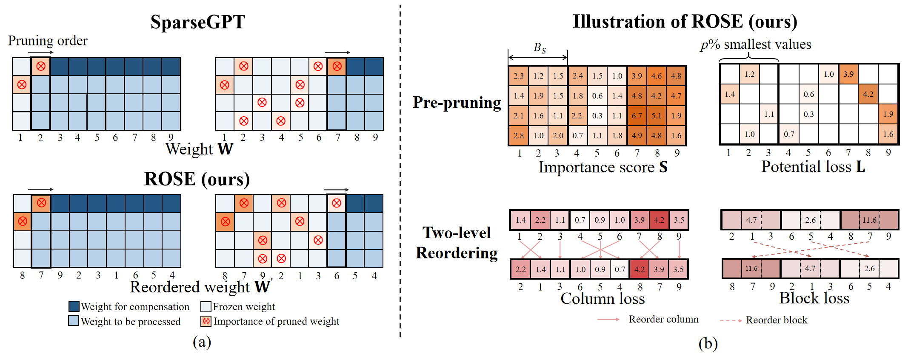

<p align="center">
 <br>
</p>


<div align="center">

# ROSE: Reordered SparseGPT for More Accurate One-Shot Large Language Models Pruning

<h3> CPAL 2026</h3>

<a href="https://arxiv.org/abs/2510.06751">

<a href="https://sunshine-0903.github.io/ROSE-Webpage/">

<a href="https://opensource.org/licenses/Apache-2.0">

</a>

**[Mingluo Su](https://sunshine-0903.github.io/)**<sup>1</sup>, **[Huan Wang](https://huanwang.tech/)**<sup>1*</sup>

<sup>1</sup>Westlake University
<br>
*<sup>*</sup>Corresponding author: wanghuan [at] westlake [dot] edu [dot] cn*

</div>


## 📖Introduction
> Pruning is widely recognized as an effective method for reducing the parameters of large language models (LLMs), potentially leading to more efficient deployment and inference. One classic and prominent path of one-shot LLM pruning is to leverage second-order gradients (i.e., Hessian), represented by the pioneering work SparseGPT. However, the predefined left-to-right pruning order in SparseGPT leads to suboptimal performance when the weights exhibit columnar patterns. This paper studies the effect of pruning order under the SparseGPT framework. The analyses lead us to propose ROSE, a reordered SparseGPT method that prioritizes weight columns with larger potential pruning errors to be processed earlier. ROSE first performs pre-pruning to identify weights that are highly likely to be pruned, and estimates both column-wise and block-wise pruning loss. The relative range of block loss is used as a metric to identify columnar layers and perform adaptive reordering for them. For the reordering operation, columns within each block are reordered in descending order of column loss, while blocks are reordered in descending order of block loss. Substantial empirical results on prevalent LLMs (LLaMA2-7B/13B/70B, LLaMA3-8B, Mistral-7B) demonstrate that ROSE surpasses the original SparseGPT and other counterpart pruning methods.

## 🖼️Overview of our ROSE 
<div align="left">
  
  <br>
  (a) Illustration of the difference between SparseGPT and ROSE. Orange color represents weight importance, and the darker the color, the greater the importance. In SparseGPT, the number of weights available for error compensation (shown in dark blue) decreases during pruning, limiting recovery if high-error weights are pruned late. ROSE reorders those with potentially large pruning errors to the front to be pruned earlier. In this way, more parameters remain available for larger error compensation. (b) Step of our proposed ROSE. Given the dense weight matrix <strong>W</strong>, we calculate the importance score matrix <strong>S</strong> and split it into blocks based on block size <strong>B<sub>S</sub></strong>. The smallest <em>p</em>% of values from each block are selected as the loss matrix <strong>L</strong>. Column loss and block loss are calculated based on the loss matrix. Columns within one block are reordered in descending order by column scores, and blocks are reordered in descending order by block scores.
</div>


## 🚀Quick Start

### 1. Install environment

```bash
git clone https://github.com/sunshine-0903/ROSE
cd ROSE
pip install -r requirements.txt
```

### 2. Execute

To prune, you can run the following command:

```bash
export HF_ENDPOINT=https://hf-mirror.com
export CUDA_VISIBLE_DEVICES=your/gpu/id

python main.py \
    --model_path your/model/path \
    --sparsity_type unstructured \
    --sparsity_ratio 0.7 \
    --prune_method ROSE \
    --eval_zero_shot \
    --tasks winogrande boolq piqa openbookqa hellaswag arc_easy arc_challenge
```

## ❤️Acknowledgements

- This source code is derived from the famous PyTorch reimplementation of [SparseGPT](https://github.com/IST-DASLab/sparsegpt), [Wanda](https://github.com/locuslab/wanda), [DSnoT](https://github.com/zyxxmu/DSnoT), [Rethinking LLM pruning](https://github.com/LOG-postech/rethinking-LLM-pruning), and [GPTAQ](https://github.com/Intelligent-Computing-Lab-Panda/GPTAQ). We thank them for their excellent open-source contributions.
- The README file is inspired by [SparseSSM](https://github.com/CFinTech/SparseSSM),[OBS-Diff](https://github.com/Alrightlone/OBS-Diff) and [MergeMix](https://github.com/JinXins/MergeMix)


## 🤗 Citation

If you find this work useful, please consider citing:
```markdown
@article{su2026rose,
  title={ROSE: Reordered SparseGPT for More Accurate One-Shot Large Language Models Pruning},
  author={Su, Mingluo and Wang, Huan},
  journal={arXiv preprint arXiv:2602.14751},
  year={2026}
}
```
